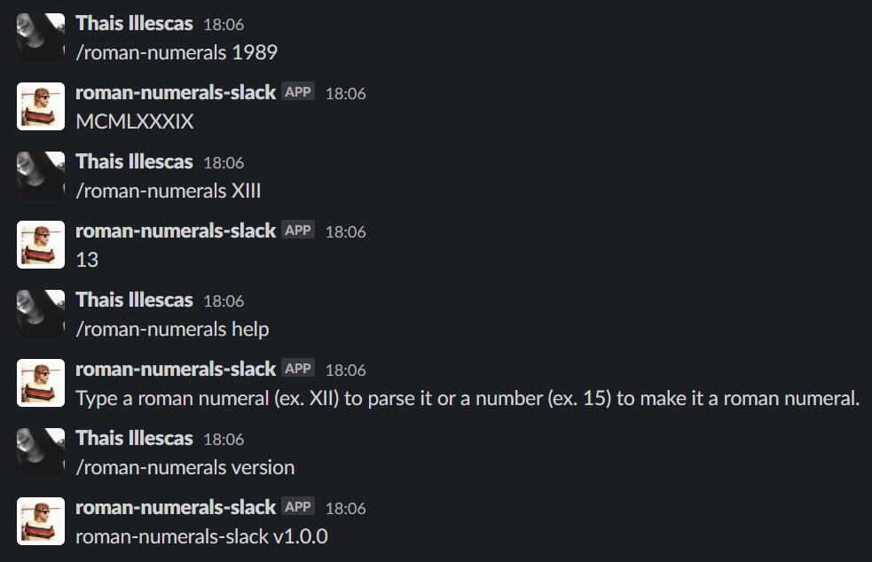
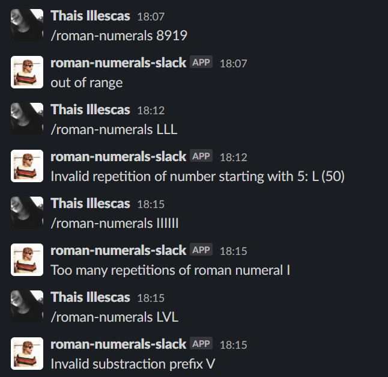

# Números romanos: slash command de Slack


## 1. Resumen del proyecto

Este proyecto depende del proyecto [`roman-numerals`](https://github.com/thainole/roman-numerals), una librería que nos permite convertir números enteros a números romanos y viceversa. El objetivo era poder integrar esta funcionalidad en un [_slash command_ de Slack](https://api.slack.com/interactivity/slash-commands).

El proyecto `roman-numerals-slack` se implementó con NodeJs y se desplegó en Heroku con el siguiente link: https://roman-slack.herokuapp.com/. Luego, se creó
una app de Slack con el mismo nombre del proyecto, y gracias a la implementación
de un _slash command_ llamado `/roman-numerals`, se pudo integrar la
funcionalidad de conversión de números romanos en el chat de Slack.

## 2. Uso mediante comandos de Slack

### [Slash Commands](https://api.slack.com/interactivity/slash-commands)

```text
/roman-numerals MMXX
2020
```

```text
/roman-numerals 2020
MMXX
```

```text
/roman-numerals help
```

```text
/roman-numerals version
```

Y así es como luce en la aplicación:



El manejo de errores se ve así:



### Servidor HTTP

Dos endpoints:

* `GET /`: Responde con un objeto JSON con dos propiedades (`name` y
  `version`). Ejemplo:

  ```json
  {
    "name": "roman-numerals-slack",
    "version": "1.0.0"
  }
  ```

* `POST /`: Este es el endpoint al que Slack enviará los comandos escritos por
  las usuarias (en el cuerpo - _body_ - de las consultas - _requests_) y
  responderá en formato JSON con un objeto como este:

  ```json
  {
    "response_type": "in_channel",
    "text": "El texto que aparecerá como respuesta en el chat de Slack"
  }
  ```

